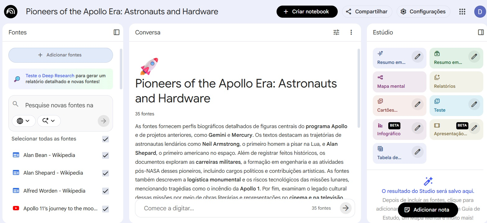
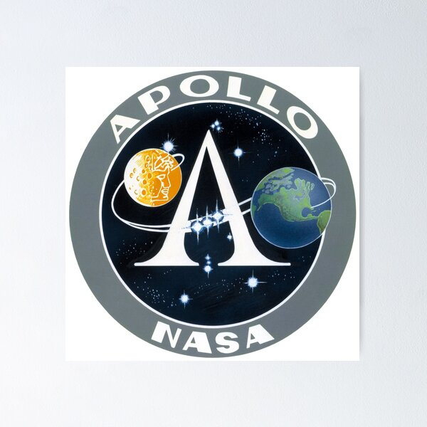

# NotebookLM

Neste desafio proposto pela DIO foi criado um Notebook LM para processar dados sobre um determinado assunto. O tema escolhido foi o programa Apollo. O programa Apollo, que levou o homem a Lua, foi o maior esforço que uma nação já fez em tempos de paz. No seu auge, mais de 400 mil pessoas trabalhavam no projeto.

Na pasta resultados foram inseridos os materiais gerados pelo Estúdio com base nas fontes utilizadas.

A seguir eu listo as fontes de dados utilizadas neste projeto.

**Fontes de Vídeo**

https://www.youtube.com/watch?v=OCjhCL2iqlQ

https://www.youtube.com/watch?v=55Jas5HrzcQ

https://www.youtube.com/watch?v=hNjI9w4Bkxs

https://www.youtube.com/watch?v=cPe0RxCXRzM

https://www.youtube.com/watch?v=vBXZ2MVEZVY

https://www.youtube.com/watch?v=WoJcvjhbJ70

https://www.youtube.com/watch?v=GNJpoP642wc

**Links**

https://en.wikipedia.org/wiki/Apollo_program

https://en.wikipedia.org/wiki/Apollo_command_and_service_module

https://en.wikipedia.org/wiki/Apollo_Lunar_Module

https://en.wikipedia.org/wiki/Saturn_V

https://en.wikipedia.org/wiki/Neil_Armstrong

https://en.wikipedia.org/wiki/Buzz_Aldrin

https://en.wikipedia.org/wiki/Pete_Conrad

https://en.wikipedia.org/wiki/Alan_Bean

https://en.wikipedia.org/wiki/Alan_Shepard

https://en.wikipedia.org/wiki/Edgar_Mitchell

https://en.wikipedia.org/wiki/David_Scott

https://en.wikipedia.org/wiki/James_Irwin

https://en.wikipedia.org/wiki/John_Young_(astronaut)

https://en.wikipedia.org/wiki/Charles_Duke

https://en.wikipedia.org/wiki/Eugene_Cernan

https://en.wikipedia.org/wiki/Harrison_Schmitt

https://en.wikipedia.org/wiki/Frank_Borman

https://en.wikipedia.org/wiki/Jim_Lovell

https://en.wikipedia.org/wiki/Bill_Anders

https://en.wikipedia.org/wiki/Thomas_P._Stafford

https://en.wikipedia.org/wiki/Michael_Collins_(astronaut)

https://en.wikipedia.org/wiki/Richard_F._Gordon_Jr.

https://en.wikipedia.org/wiki/Jack_Swigert

https://en.wikipedia.org/wiki/Fred_Haise

https://en.wikipedia.org/wiki/Stuart_Roosa

https://en.wikipedia.org/wiki/Alfred_Worden

https://en.wikipedia.org/wiki/Ken_Mattingly

https://en.wikipedia.org/wiki/Ronald_Evans_(astronaut)

